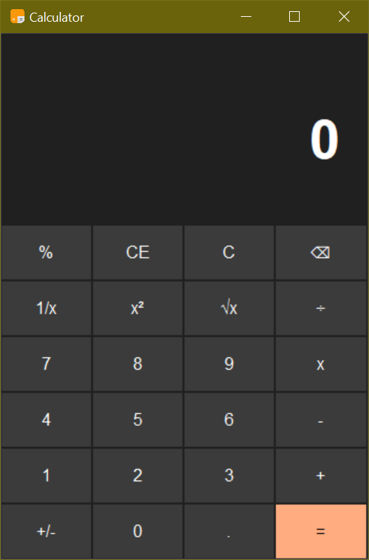
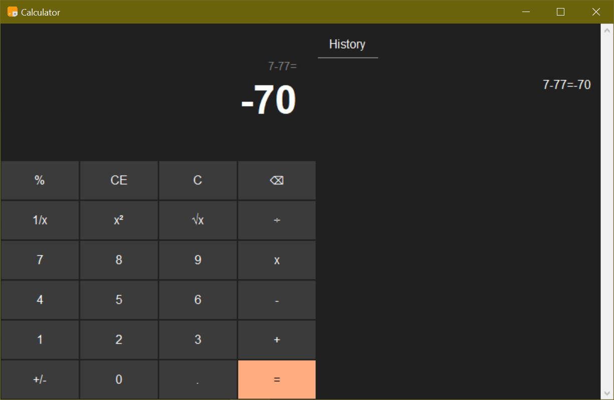

# Calculator
python Calculator for windows - responsive - with history section - 


Mini size             |  Full size
:-------------------------:|:-------------------------:
  |  

---


## Create exe file 
use the command below in pycharm terminal to get exe file

```shell
pip install pyinstaller
pyinstaller --onefile -w Calculator.py 
```
